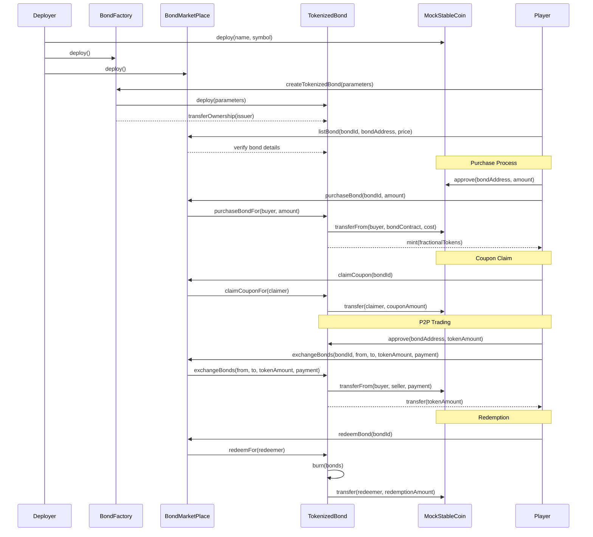
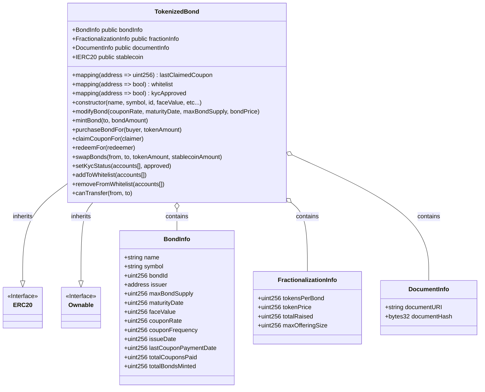
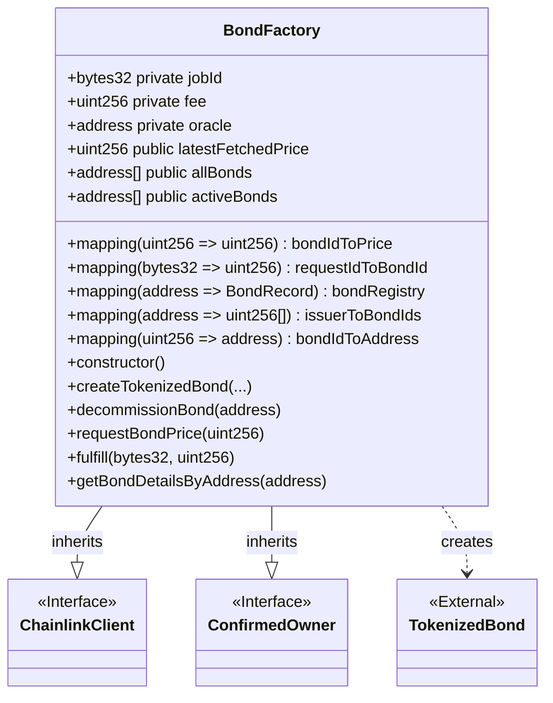
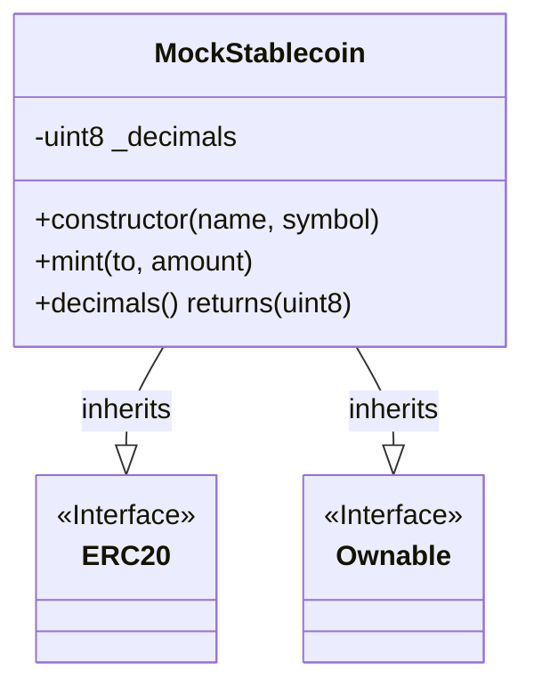
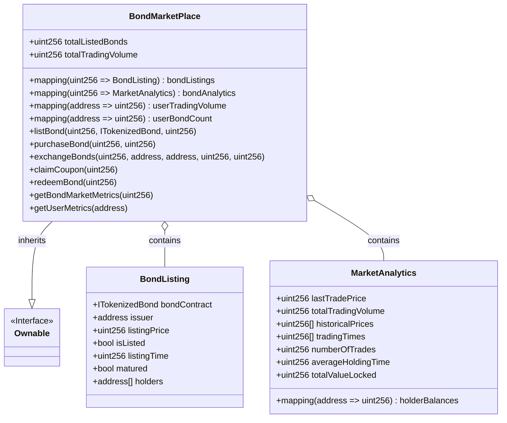

<!-- omit in toc -->
# Blockchain-based fractional bond trading
A proof of concept implementation of a blockchain-based fractional bond trading platform

<!-- omit in toc -->
## Table of Contents
- [Setup Guide](#setup-guide)
  - [Prerequisites](#prerequisites)
  - [Project Structure](#project-structure)
  - [Installation](#installation)
  - [Running the project](#running-the-project)
- [Smart Contract Overview](#smart-contract-overview)
  - [TokenizedBond Contract](#tokenizedbond-contract)
  - [BondFactory Contract](#bondfactory-contract)
  - [MockStableCoin Contract](#mockstablecoin-contract)
  - [BondMarketPlace Contract](#bondmarketplace-contract)
- [User Story](#user-story)
  
---
### Setup Guide

This guide will help you set up and run the project locally.

#### Prerequisites

- [Node.js](https://nodejs.org/en/) (LTS version is recommended)
- npm (comes with Node.js)

#### Project Structure

The repository contains two main parts:

1. **Smart Contract / Backend Code:**  
   Located at the repository root. This part uses Hardhat for blockchain development.

2. **React Frontend:**  
   Located in the `frontend` folder. This part is a React application created with Create React App.

#### Installation

**1. Clone the Repository**

```bash
git clone https://github.com/whanyu1212/fractional-bond-trading.git
cd fractional-bond-trading
```
**2. Install Dependencies**

For the Root Project (Smart Contracts / Backend):
```bash
npm install
```

For the React Frontend:
```bash
cd frontend
npm install
cd ..
```

#### Running the project

**1. Running the smart contract/backend**
```bash
npx hardhat compile
npx hardhat test
```

**2. Running the React Frontend**
```bash
cd frontend
npm start
```
<br>

<u>Remark:</u> Both the root and the React frontend have their own node_modules folders. Make sure you run ```npm install``` in both locations before starting development.

<br>

---

### Smart Contract Overview



---

#### TokenizedBond Contract

The `TokenizedBond` contract is an ERC20 token that represents a bond with a fixed coupon rate and maturity date. It inherits from OpenZeppelin's `ERC20` and `Ownable` contracts, providing token functionality and access control. The contract includes features for bond lifecycle management, fractional ownership, regulatory compliance (KYC and whitelisting), and financial safety.

<details>
<summary><strong>State Variables</strong></summary>

<u>Compliance and Security</u>

*   `DocumentInfo`: Struct containing:
    *   `documentURI`: URI to the legal document associated with the bond.
    *   `documentHash`: Hash of the legal document for verification.

<u>Bond Details</u>

*   `BondInfo`: Struct containing:
    *   `name`: Name of the bond.
    *   `symbol`: Symbol of the bond.
    *   `bondId`: Unique identifier for the bond.
    *   `issuer`: Address of the bond issuer.
    *   `maxBondSupply`: Maximum number of bonds that can be issued.
    *   `maturityDate`: UNIX timestamp for maturity.
    *   `faceValue`: Total principal amount of the bond.
    *   `couponRate`: Annual coupon rate (in basis points).
    *   `couponFrequency`: Number of coupon payments per year.
    *   `issueDate`: Date the bond was issued.
    *   `lastCouponPaymentDate`: Date of the last coupon payment.
    *   `totalCouponsPaid`: Total number of coupons paid.
    *   `totalBondsMinted`: Total number of bonds minted.

<u>Fractionalization</u>

*   `FractionalizationInfo`: Struct containing:
    *   `tokensPerBond`: Total ERC20 tokens representing one bond.
    *   `tokenPrice`: Price of one token in stablecoin.
    *   `totalRaised`: Total amount raised from bond sales.
    *   `maxOfferingSize`: Maximum amount of stablecoin to raise.

<u>Public Variables</u>

*   `bondInfo`: Public variable of type `BondInfo` storing the bond's details.
*   `fractionInfo`: Public variable of type `FractionalizationInfo` storing the fractionalization details.
*   `documentInfo`: Public variable of type `DocumentInfo` storing document details.
*   `lastClaimedCoupon`: Mapping of address to `uint256` storing the timestamp of the last coupon claimed by each holder.
*   `stablecoin`: Public variable of type `IERC20` representing the stablecoin used for payments.
*   `whitelist`: Mapping of address to `bool` indicating whether an address is whitelisted for transfers.
*   `kycApproved`: Mapping of address to `bool` indicating whether an address has passed KYC.
</details>

<br>

<details>
<summary><strong>Functions</strong></summary>

<u>Constructor</u>

*   `constructor(string memory _name, string memory _symbol, uint256 _id, uint256 _faceValue, uint256 _couponRate, uint256 _couponFrequency, uint256 _maturityDate, address _issuer, address _stablecoinAddress, uint256 _tokensPerBond, uint256 _tokenPrice, uint256 _maxBondSupply, uint256 _maxOfferingSize)`: Initializes the bond with the provided parameters, including bond details, fractionalization info, and the stablecoin address.

<u>External Functions</u>

*   `modifyBond(uint256 _couponRate, uint256 _maturityDate, uint256 _maxBondSupply, uint256 _tokenPrice, uint256 _maxOfferingSize)`: Modifies bond parameters. Owner only.
*   `mintBond(address to, uint256 bondAmount)`: Mints new bonds to a specified address. Owner only.
*   `purchaseBondFor(address buyer, uint256 bondAmount)`: Allows primary market purchase of bonds.
*   `claimCouponFor(address claimer)`: Claims coupon payments for a holder.
*   `batchClaimCoupons(address[] calldata claimers)`: Claims coupons for multiple holders.
*   `redeemFor(address redeemer)`: Redeems bonds after maturity.
*   `batchRedeemBonds(address[] calldata redeemers)`: Redeems bonds for multiple holders.
*   `exchangeBonds(address from, address to, uint256 tokenAmount, uint256 stablecoinAmount)`: Facilitates P2P bond trading/gifting.

<u>View Functions</u>

*   `getBondPrice()`: Returns bond price in stablecoin.
*   `getBondId()`: Returns bond ID.
*   `getCouponFrequency()`: Returns coupon payment frequency.
*   `getStablecoinAddress()`: Returns stablecoin contract address.
*   `getTokensPerBond()`: Returns tokens per bond ratio.
*   `verifyDocument(string calldata)`: Verifies document hash.

<u>Internal Functions</u>

*   `_beforeTokenTransfer(address from, address to, uint256 amount)`: Pre-transfer validation hook.
</details>

<br>

<details>
<summary><strong>Events</strong></summary>

*   `BondModified(uint256 couponRate, uint256 maturityDate, uint256 maxBondSupply, uint256 tokenPrice)`: Parameter updates.
*   `BondMinted(address indexed to, uint256 bondAmount, uint256 tokenAmount)`: New token minting.
*   `BondPurchased(address indexed buyer, uint256 bondAmount)`: Primary market purchases.
*   `CouponPaid(address indexed claimer, uint256 couponAmount)`: Coupon payments.
*   `BondRedeemed(address indexed redeemer, uint256 redemptionAmount)`: Redemptions.
*   `DocumentURIUpdated(string documentURI)`: Documentation URI updates.
*   `DocumentHashUpdated(bytes32 documentHash)`: Documentation hash updates.
*   `AddedToWhitelist(address indexed account)`: Whitelist additions.
*   `RemovedFromWhitelist(address indexed account)`: Whitelist removals.
*   `KycStatusChanged(address indexed account, bool approved)`: KYC status changes.
*   `BondTraded(address indexed from, address indexed to, uint256 tokenAmount, uint256 stablecoinAmount)`: P2P trades.
*   `BondGifted(address indexed from, address indexed to, uint256 tokenAmount)`: P2P gifts.
</details>

<br>

<details>
<summary><strong>Class Diagram</strong></summary>


</details>

---

#### BondFactory Contract

The `BondFactory` contract manages the creation and lifecycle of `TokenizedBond` instances. It serves as a factory and registry, providing a centralized interface for interacting with multiple bond contracts. The contract implements Chainlink integration for real-time pricing data.

<details>
<summary><strong>State Variables</strong></summary>

<u>Chainlink Oracle State</u>

* `jobId`: ID of the Chainlink job for price queries
* `fee`: Fee paid for Chainlink requests
* `oracle`: Address of the Chainlink oracle
* `latestFetchedPrice`: Most recently fetched price from Chainlink
* `bondIdToPrice`: Maps bond ID to its current price
* `requestIdToBondId`: Maps Chainlink request IDs to bond IDs

<u>Registry State</u>

* `BondRecord`: Struct containing minimal metadata:
  * `bondAddress`: Address of the deployed TokenizedBond contract
  * `bondId`: The unique ID provided during creation
  * `issuer`: Address designated as the issuer
  * `active`: Managed by the factory (true on creation, false on decommission)
  * `creationTimestamp`: Timestamp of creation in the factory
  * `decommissionTimestamp`: Timestamp of decommissioning in the factory

* `BondDetails`: Extended struct for detailed views containing:
  * Factory Record fields (bondId, issuer, timestamps, etc.)
  * TokenizedBond Contract fields (name, symbol, face value, etc.)
  * Current state (totalRaised, isActive, etc.)

<u>Storage Mappings & Arrays</u>

* `allBonds`: Array of all bond addresses ever created
* `activeBonds`: Array of currently active bond addresses
* `bondRegistry`: Maps bond address to its BondRecord
* `issuerToBondIds`: Maps issuer address to their bond IDs
* `bondIdToAddress`: Maps unique bond ID to contract address

</details>

<br>

<details>
<summary><strong>Functions</strong></summary>

<u>Constructor</u>

* `constructor()`: Initializes Chainlink configuration for Sepolia testnet

<u>Core Factory Operations</u>

* `createTokenizedBond(...)`: Creates new TokenizedBond contract with specified parameters
* `decommissionBond(address bondAddress)`: Marks a bond as inactive in registry

<u>Chainlink Oracle Operations</u>

* `requestBondPrice(uint256 bondId)`: Requests price update via Chainlink
* `fulfill(bytes32 _requestId, uint256 _price)`: Callback for Chainlink price updates
* `withdrawLink()`: Allows owner to withdraw LINK tokens

<u>Basic Registry Views</u>

* `getBondRecord(address)`: Returns basic bond registry information
* `getBondPricebyId(uint256)`: Returns latest Chainlink price for bond
* `getBondIssuancePrice(uint256)`: Returns initial issuance price
* `getTotalBondCount()`: Returns total bonds created
* `getActiveBondCount()`: Returns number of active bonds
* `getBondsByIssuer(address)`: Returns all bonds by issuer
* `isBondActive(address)`: Checks if bond is active
* `getLatestBond()`: Returns most recent bond address
* `getBondByIndex(uint256)`: Returns bond address by index

<u>Detailed View Functions</u>

* `getActiveBondDetailsByBondId(uint256)`: Returns complete bond details by ID
* `getBondDetailsByAddress(address)`: Returns complete bond details by address

</details>

<br>

<details>
<summary><strong>Events</strong></summary>

* `TokenizedBondCreated(address indexed bondAddress, string name, string symbol, address indexed issuer)`
* `BondDecommissioned(address indexed bondAddress, string name, string symbol, uint256 timestamp)`
* `BondModified(address indexed bondAddress, uint256 couponRate, uint256 maturityDate, uint256 maxBondSupply, uint256 tokenPrice)`
* `RequestPrice(bytes32 indexed requestId, uint256 price)`

</details>

<br>

<details>
<summary><strong>Class Diagram</strong></summary>


</details>

---
#### MockStableCoin Contract

The `MockStableCoin` contract is a simple ERC20 token implementation designed to simulate a stablecoin like USDC for testing purposes. It inherits from OpenZeppelin's `ERC20` and `Ownable` contracts, providing standard token functionality and access control.

<details>
<summary><strong>State Variables</strong></summary>

* `_decimals`: Private variable set to 6 to match USDC's decimal places.
</details>

<br>

<details>
<summary><strong>Functions</strong></summary>

<u>Constructor</u>

* `constructor(string memory name, string memory symbol)`: Initializes the stablecoin with the provided name and symbol, setting the deployer as the owner.

<u>Token Operations</u>

* `mint(address to, uint256 amount)`: Creates new tokens and assigns them to the specified address. This function is publicly accessible for testing purposes.

<u>View Functions</u>

* `decimals() returns (uint8)`: Overrides the standard ERC20 decimals function to return 6, matching USDC's decimal places instead of the default 18.
</details>

<br>

<details>
<summary><strong>Inherited Functionality</strong></summary>

<u>From ERC20</u>

* Standard token functions like `transfer`, `approve`, `transferFrom`, `balanceOf`, `allowance`, etc.

<u>From Ownable</u>

* Access control functions like `owner`, `transferOwnership`, `renounceOwnership`.
* Modifier `onlyOwner` for restricting function access.
</details>

<br>

<details>
<summary><strong>Class Diagram</strong></summary>


</details>

---

#### BondMarketPlace Contract

The `BondMarketPlace` contract provides a marketplace for listing, trading, and managing tokenized bonds. It serves as a central hub for bond trading, offering features like bond listings, price tracking, market analytics, and batch operations for coupon claims and redemptions.

<details>
<summary><strong>State Variables</strong></summary>

<u>Listing Structure</u>

* `BondListing`: Struct containing:
  * `bondContract`: Reference to the ITokenizedBond contract
  * `issuer`: Address of bond issuer
  * `listingPrice`: Current listing price
  * `isListed`: Active listing status
  * `listingTime`: Initial listing timestamp
  * `matured`: Bond maturity status
  * `holders`: Historical holders array

<u>Analytics Structure</u>

* `MarketAnalytics`: Struct containing:
  * `lastTradePrice`: Last price traded at
  * `totalTradingVolume`: Cumulative trading volume
  * `historicalPrices`: Array of historical trade prices
  * `tradingTimes`: Array of trade timestamps
  * `numberOfTrades`: Total trade count
  * `holderBalances`: Maps holder address to token balance
  * `averageHoldingTime`: Average holding duration
  * `totalValueLocked`: Total value in bond

<u>Registry Mappings</u>

* `bondListings`: Maps bondId to BondListing
* `bondAnalytics`: Maps bondId to MarketAnalytics
* `totalListedBonds`: Count of listed bonds
* `totalTradingVolume`: Global trading volume
* `userTradingVolume`: Maps user address to their trading volume
* `userBondCount`: Maps user address to number of bonds held

</details>

<br>

<details>
<summary><strong>Functions</strong></summary>

<u>Listing Management</u>

* `listBond(uint256 bondId, ITokenizedBond bondAddress, uint256 price)`: Creates new bond listing
* `modifyListing(uint256 bondId, uint256 newPrice)`: Updates listing price
* `delistBond(uint256 bondId)`: Removes bond listing
* `updateBondMaturity(uint256 bondId, bool matured)`: Updates bond maturity status

<u>Trading Operations</u>

* `purchaseBond(uint256 bondId, uint256 bondAmount)`: Purchases bonds from primary market
* `exchangeBonds(uint256 bondId, address from, address to, uint256 tokenAmount, uint256 stablecoinAmount)`: Facilitates P2P trading

<u>Coupon Management</u>

* `claimCoupon(uint256 bondId)`: Claims coupon for single holder
* `batchClaimCoupons(uint256 bondId, address[] calldata claimers)`: Claims coupons for multiple holders
* `multiClaimCoupons(uint256[] calldata bondIds, address[][] calldata claimers)`: Claims coupons across multiple bonds

<u>Redemption Operations</u>

* `redeemBond(uint256 bondId)`: Redeems matured bonds
* `batchRedeemBonds(uint256 bondId, address[] calldata redeemers)`: Redeems for multiple holders
* `multiRedeemBonds(uint256[] calldata bondIds, address[][] calldata redeemers)`: Redeems across multiple bonds

<u>Analytics & View Functions</u>

* `getBondInfo(uint256 bondId)`: Returns basic listing information
* `getBondMarketMetrics(uint256 bondId)`: Returns market performance metrics
* `getUserMetrics(address user)`: Returns user trading statistics
* `getActualUserHoldingsWithDetails(address user)`: Returns detailed bond holdings
* `getAnalyticsHolderBalance(uint256 bondId, address holder)`: Returns marketplace-tracked balance

</details>

<br>

<details>
<summary><strong>Events</strong></summary>

* `BondListed(uint256 indexed bondId, address indexed issuer, uint256 price)`
* `BondDelisted(uint256 indexed bondId, address indexed delister)`
* `BondPurchaseRecorded(uint256 indexed bondId, address indexed buyer, uint256 amount)`
* `BondMaturityUpdated(uint256 indexed bondId, bool matured)`
* `BondRedemptionRecorded(uint256 indexed bondId, address indexed holder, uint256 amount)`
* `BondExchanged(uint256 indexed bondId, address indexed from, address indexed to, uint256 tokenAmount, uint256 stablecoinAmount)`
* `BondGifted(uint256 indexed bondId, address indexed from, address indexed to, uint256 tokenAmount)`

</details>

<br>

<details>
<summary><strong>Class Diagram</strong></summary>


</details>

---

### User Story

```mermaid
flowchart LR
    subgraph Platform["<font size=6>Fractional Bond Trading</font>"]
        direction LR
        subgraph "System Deployment"
            D1[Admin] -->|Deploys| D2["Core Contracts
            1. MockStableCoin
            2. BondFactory
            3. BondMarketplace"]
            D2 -->|Creates| D3["Bond Instance
            • Set Parameters
            • Fund Contract"]
            D3 -->|Lists| D4[Initial Offerings]
        end

        subgraph "Investment"
            A[Investor] -->|Browses| B[Bond Marketplace]
            B -->|Reviews| C["Bond Details
            • Price
            • Coupon Rate
            • Maturity Date"]
            C -->|Approves| E["Stablecoin Spend
            to TokenizedBond"]
            E -->|Executes| F[Purchase via
            Marketplace]
        end

        subgraph "Holding Period"
            F -->|Holds| G[Position]
            G -->|Regular| H[Claim Coupons]
            G -->|Optional| I[Secondary Market]
            
            I -->|Trade| J["P2P Exchange
            1. Approve Tokens
            2. Set Price
            3. Execute"]
            
            I -->|Gift| K["Gift Transfer
            1. Approve Tokens
            2. Execute"]
        end

        subgraph "Maturity"
            H & J & K -->|Until| N[Bond Matures]
            N -->|Redeem| P[Final Payment]
        end
    end

    D4 --> B

    style A fill:#f9f,stroke:#333,stroke-width:2px
    style D1 fill:#f9f,stroke:#333,stroke-width:2px
    style N fill:#bbf,stroke:#333,stroke-width:2px
    style P fill:#bfb,stroke:#333,stroke-width:2px
    
    classDef optional fill:#f96,stroke:#333,stroke-width:1px
    class I,J,K optional
    classDef deployment fill:#e6fff2,stroke:#333,stroke-width:1px
    class D1,D2,D3,D4 deployment

    %% Remove coloring from Platform wrapper
    style Platform fill:none
```

