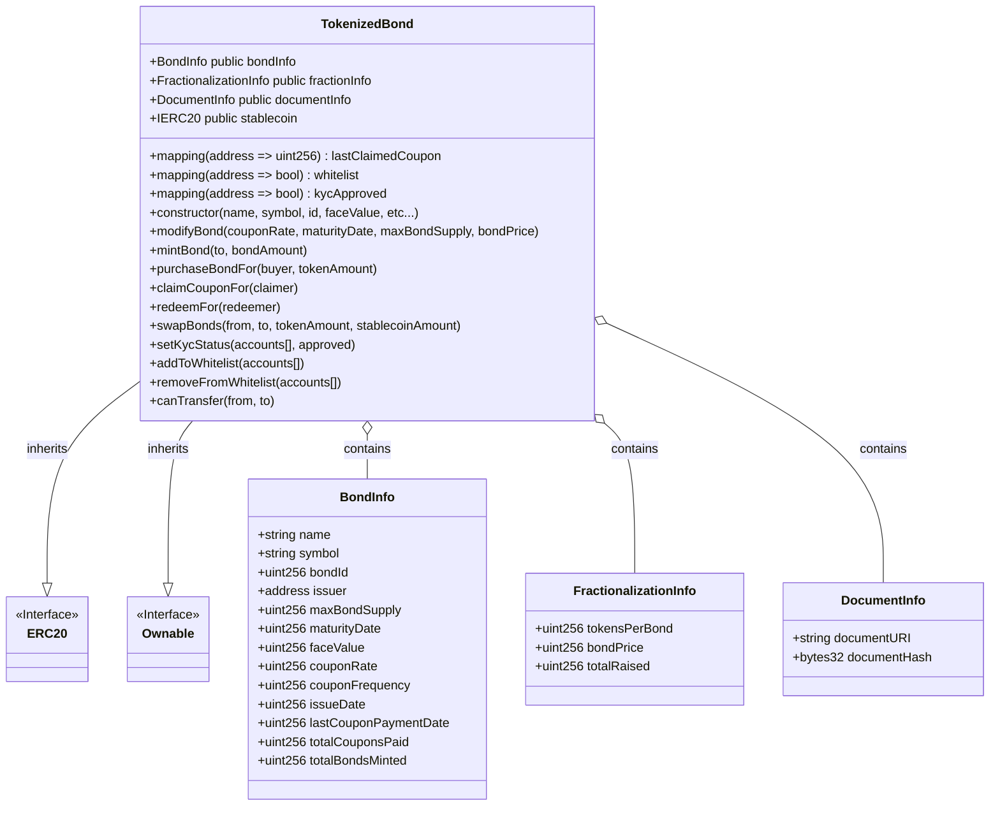
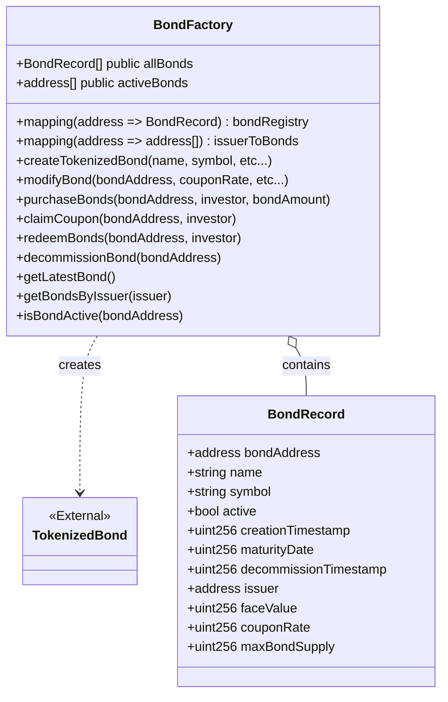

<!-- omit in toc -->
# Blockchain-based fractional bond trading
A proof of concept implementation of a blockchain-based fractional bond trading platform

<!-- omit in toc -->
## Table of Contents
- [Setup Guide](#setup-guide)
  - [Prerequisites](#prerequisites)
  - [Project Structure](#project-structure)
  - [Installation](#installation)
  - [Running the project](#running-the-project)
- [Smart Contract Overview](#smart-contract-overview)
  - [TokenizedBond Contract](#tokenizedbond-contract)
  - [BondFactory Contract](#bondfactory-contract)
  
---
### Setup Guide

This guide will help you set up and run the project locally.

#### Prerequisites

- [Node.js](https://nodejs.org/en/) (LTS version is recommended)
- npm (comes with Node.js)

#### Project Structure

The repository contains two main parts:

1. **Smart Contract / Backend Code:**  
   Located at the repository root. This part uses Hardhat for blockchain development.

2. **React Frontend:**  
   Located in the `frontend` folder. This part is a React application created with Create React App.

#### Installation

**1. Clone the Repository**

```bash
git clone https://github.com/whanyu1212/fractional-bond-trading.git
cd fractional-bond-trading
```
**2. Install Dependencies**

For the Root Project (Smart Contracts / Backend):
```bash
npm install
```

For the React Frontend:
```bash
cd frontend
npm install
cd ..
```

#### Running the project

**1. Running the smart contract/backend**
```bash
npx hardhat compile
npx hardhat test
```

**2. Running the React Frontend**
```bash
cd frontend
npm start
```
<br>

<u>Remark:</u> Both the root and the React frontend have their own node_modules folders. Make sure you run ```npm install``` in both locations before starting development.

<br>

---

### Smart Contract Overview
#### TokenizedBond Contract
The TokenizedBond Contract is an ERC20-compliant token with additional capabilities. The key features are as follow:

1. Bond Lifecycle Management:
   - Initial bond creation with parameters like face value, coupon rate, and maturity date
   - Stablecoin as means of payment
   - Minting of bond tokens to represent ownership
   - Semi-annual coupon payments to token holders
   - Principal redemption at maturity

2. Fractionalization System:
   - Allow fractional ownership, investors can purchase in terms of tokens instead of entire bonds
   - Handles coupon payments proportionally based on token holdings
   - Supports secondary market trading through swapBonds function
  
3. Regulatory Compliance:
   - Built-in KYC and whitelist mechanisms (Dummy for now)
   - Document verification system for legal documentation (Dummy for now)
   - Transfer restrictions based on KYC status (Dummy for now)
   - Access control through OpenZeppelin's Ownable

4. Financial Safety:
   - Uses SafeERC20 to prevent reentrancy attacks (`safetransfer`)
   - Requires sufficient reserves for future coupon payments
   - Validates all transactions against maturity status
   - Enforces supply limits and trading restrictions

<br>



#### BondFactory Contract
The BondFactory mainly serves as factory/registry, providing a single point of interaction for managing multiple TokenizedBond instances. The key features as as follow:

1. Factory Pattern Implementation:
   - Creates new TokenizedBond instances using createTokenizedBond()
   - Manages the lifecycle of bond contracts
   - Maintains a registry of all created bonds

2. Bond Registry Management:
   - Tracks all bonds through allBonds[] array
   - Maintains active bonds in activeBonds[] array
   - Maps bonds to issuers via issuerToBonds mapping
   - Stores bond details in bondRegistry mapping

3. Proxy Operations:
   - Acts as a wrapper to interact with individual TokenizedBond contracts
   - Provides unified interface for bond operations like:
      - Purchase (purchaseBonds)
      - Coupon claims (claimCoupon)
      - Redemption (redeemBonds)
      - Whitelisting and KYC management

4. Query Interface:
   - Provides view functions to query bond states
   - Allows filtering by issuer, status, and index
   - Supports bond detail retrieval and validation

