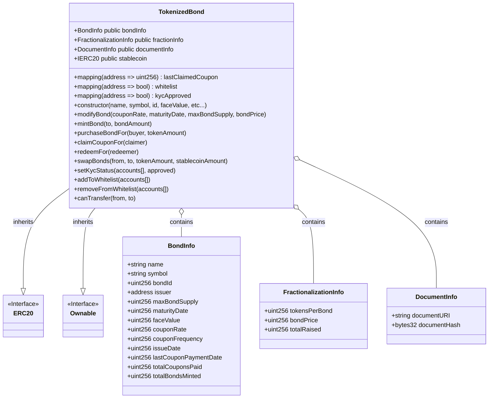
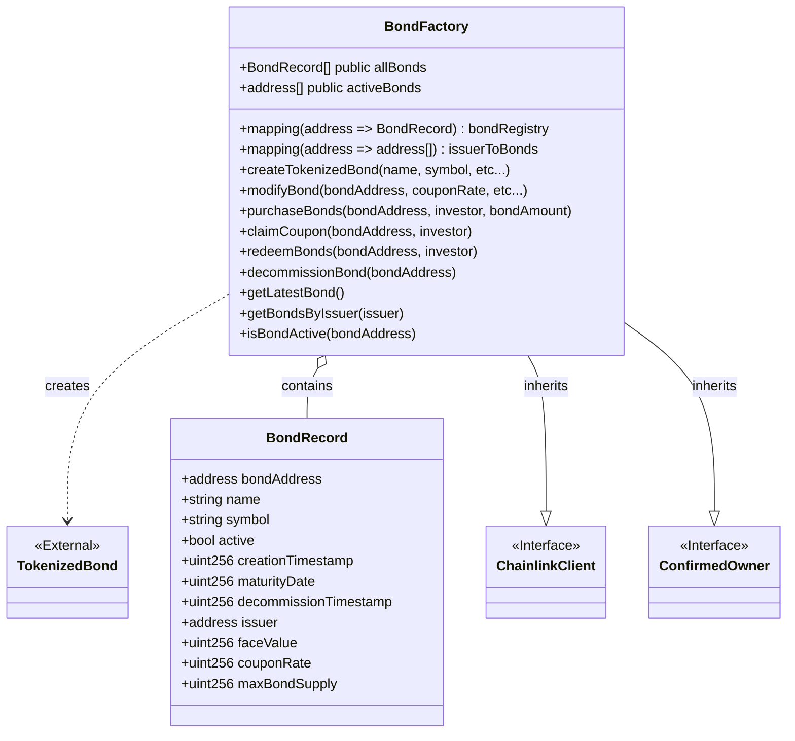
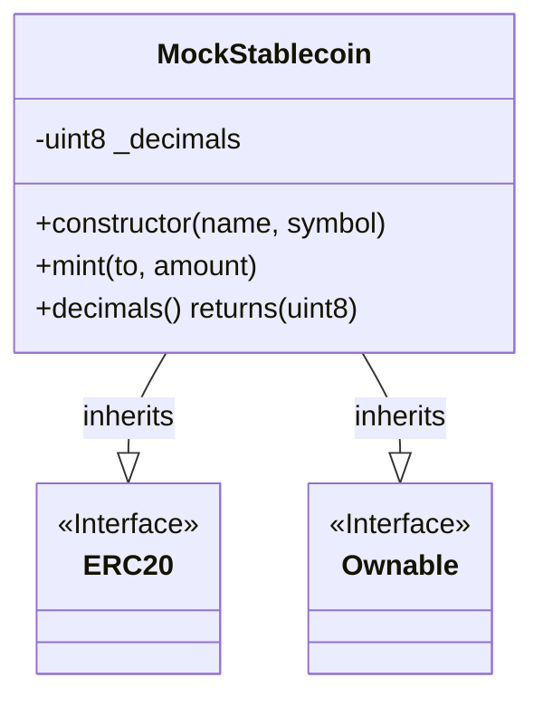
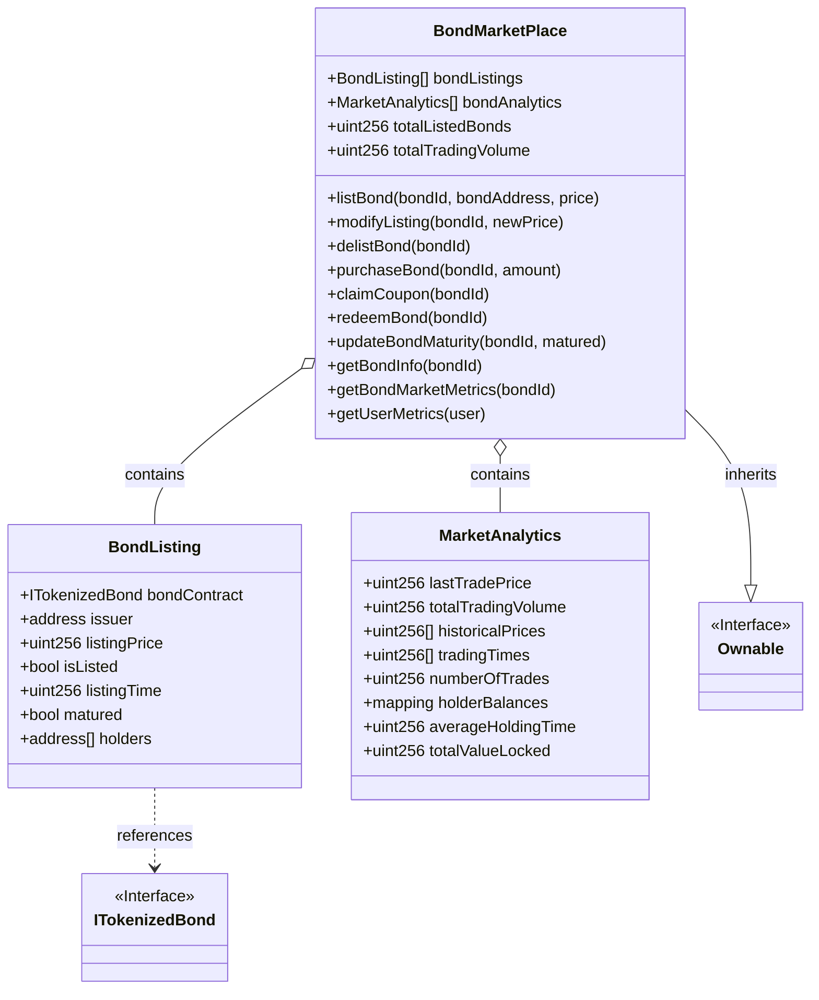

<!-- omit in toc -->
# Blockchain-based fractional bond trading
A proof of concept implementation of a blockchain-based fractional bond trading platform

<!-- omit in toc -->
## Table of Contents
- [Setup Guide](#setup-guide)
  - [Prerequisites](#prerequisites)
  - [Project Structure](#project-structure)
  - [Installation](#installation)
  - [Running the project](#running-the-project)
- [Smart Contract Overview](#smart-contract-overview)
  - [TokenizedBond Contract](#tokenizedbond-contract)
  - [BondFactory Contract](#bondfactory-contract)
  - [MockStableCoin Contract](#mockstablecoin-contract)
  - [BondMarketPlace Contract](#bondmarketplace-contract)
  
---
### Setup Guide

This guide will help you set up and run the project locally.

#### Prerequisites

- [Node.js](https://nodejs.org/en/) (LTS version is recommended)
- npm (comes with Node.js)

#### Project Structure

The repository contains two main parts:

1. **Smart Contract / Backend Code:**  
   Located at the repository root. This part uses Hardhat for blockchain development.

2. **React Frontend:**  
   Located in the `frontend` folder. This part is a React application created with Create React App.

#### Installation

**1. Clone the Repository**

```bash
git clone https://github.com/whanyu1212/fractional-bond-trading.git
cd fractional-bond-trading
```
**2. Install Dependencies**

For the Root Project (Smart Contracts / Backend):
```bash
npm install
```

For the React Frontend:
```bash
cd frontend
npm install
cd ..
```

#### Running the project

**1. Running the smart contract/backend**
```bash
npx hardhat compile
npx hardhat test
```

**2. Running the React Frontend**
```bash
cd frontend
npm start
```
<br>

<u>Remark:</u> Both the root and the React frontend have their own node_modules folders. Make sure you run ```npm install``` in both locations before starting development.

<br>

---

### Smart Contract Overview
#### TokenizedBond Contract

The `TokenizedBond` contract is an ERC20 token that represents a bond with a fixed coupon rate and maturity date. It inherits from OpenZeppelin's `ERC20` and `Ownable` contracts, providing token functionality and access control. The contract includes features for bond lifecycle management, fractional ownership, regulatory compliance (KYC and whitelisting), and financial safety.

<details>
<summary><strong>State Variables</strong></summary>

<u>Compliance and Security</u>

*   `DocumentInfo`: Struct containing:
    *   `documentURI`: URI to the legal document associated with the bond.
    *   `documentHash`: Hash of the legal document for verification.

<u>Bond Details</u>

*   `BondInfo`: Struct containing:
    *   `name`: Name of the bond.
    *   `symbol`: Symbol of the bond.
    *   `bondId`: Unique identifier for the bond.
    *   `issuer`: Address of the bond issuer.
    *   `maxBondSupply`: Maximum number of bonds that can be issued.
    *   `maturityDate`: UNIX timestamp for maturity.
    *   `faceValue`: Total principal amount of the bond.
    *   `couponRate`: Annual coupon rate (in basis points).
    *   `couponFrequency`: Number of coupon payments per year.
    *   `issueDate`: Date the bond was issued.
    *   `lastCouponPaymentDate`: Date of the last coupon payment.
    *   `totalCouponsPaid`: Total number of coupons paid.
    *   `totalBondsMinted`: Total number of bonds minted.

<u>Fractionalization</u>

*   `FractionalizationInfo`: Struct containing:
    *   `tokensPerBond`: Total ERC20 tokens representing one bond.
    *   `tokenPrice`: Price of one token in stablecoin.
    *   `totalRaised`: Total amount raised from bond sales.

<u>Public Variables</u>

*   `bondInfo`: Public variable of type `BondInfo` storing the bond's details.
*   `fractionInfo`: Public variable of type `FractionalizationInfo` storing the fractionalization details.
*   `documentInfo`: Public variable of type `DocumentInfo` storing document details.
*   `lastClaimedCoupon`: Mapping of address to `uint256` storing the timestamp of the last coupon claimed by each holder.
*   `stablecoin`: Public variable of type `IERC20` representing the stablecoin used for payments.
*   `whitelist`: Mapping of address to `bool` indicating whether an address is whitelisted for transfers.
*   `kycApproved`: Mapping of address to `bool` indicating whether an address has passed KYC.
</details>

<br>

<details>
<summary><strong>Functions</strong></summary>

<u>Constructor</u>

*   `TokenizedBond(string memory _name, string memory _symbol, uint256 _id, uint256 _faceValue, uint256 _couponRate, uint256 _couponFrequency, uint256 _maturityDate, address _issuer, address _stablecoinAddress, uint256 _tokensPerBond, uint256 _tokenPrice, uint256 _maxBondSupply)`: Initializes the bond with the provided parameters, including bond details, fractionalization info, and the stablecoin address. It also sets the owner of the contract.

<u>External Functions</u>

*   `modifyBond(uint256 _couponRate, uint256 _maturityDate, uint256 _maxBondSupply, uint256 _tokenPrice)`: Modifies bond parameters such as coupon rate, maturity date, maximum bond supply, and token price. Can only be called by the owner.
*   `mintBond(address to, uint256 bondAmount)`: Mints new bonds to the specified address. Can only be called by the owner.
*   `setDocumentURI(string calldata _documentURI)`: Sets the document URI for legal documentation. Can only be called by the owner.
*   `setDocumentHash(bytes32 _documentHash)`: Sets the document hash for legal documentation. Can only be called by the owner.
*   `addToWhitelist(address[] calldata accounts)`: Adds addresses to the transfer whitelist. Can only be called by the owner.
*   `removeFromWhitelist(address[] calldata accounts)`: Removes addresses from the transfer whitelist. Can only be called by the owner.
*   `setKycStatus(address[] calldata accounts, bool approved)`: Sets KYC status for accounts. Can only be called by the owner.
*   `purchaseBondFor(address buyer, uint256 tokenAmount)`: Allows a buyer to purchase bonds in terms of tokens.
*   `claimCouponFor(address claimer)`: Allows a holder to claim coupon payments.
*   `redeemFor(address redeemer)`: Allows a holder to redeem the bond after maturity.
*   `swapBonds(address from, address to, uint256 tokenAmount, uint256 stablecoinAmount)`: Swaps bonds between two approved holders.

<u>View Functions</u>

*   `getBondPrice()`: Returns the bond price in stablecoin.
*   `getBondId()`: Returns the bond ID.
*   `verifyDocument(string calldata documentContent)`: Verifies the hash of a document.
*   `canTransfer(address from, address to)`: Checks if a transfer is allowed based on whitelist, KYC, and maturity status.

<u>Internal Functions</u>

*   `_beforeTokenTransfer(address from, address to, uint256 amount)`:  This function is overridden from the ERC20 contract.  It checks if a transfer is allowed using the `canTransfer` function before any token transfer occurs.
</details>

<br>

<details>
<summary><strong>Events</strong></summary>

*   `BondModified(uint256 couponRate, uint256 maturityDate, uint256 maxBondSupply, uint256 tokenPrice)`: Emitted when bond parameters are modified.
*   `BondMinted(address indexed to, uint256 bondAmount, uint256 tokenAmount)`: Emitted when new bonds are minted.
*   `BondPurchased(address indexed buyer, uint256 bondAmount)`: Emitted when bonds are purchased.
*   `CouponPaid(address indexed claimer, uint256 couponAmount)`: Emitted when coupon payments are made.
*   `BondRedeemed(address indexed redeemer, uint256 redemptionAmount)`: Emitted when bonds are redeemed.
*   `DocumentURIUpdated(string documentURI)`: Emitted when the document URI is updated.
*   `DocumentHashUpdated(bytes32 documentHash)`: Emitted when the document hash is updated.
*   `AddedToWhitelist(address indexed account)`: Emitted when an address is added to the whitelist.
*   `RemovedFromWhitelist(address indexed account)`: Emitted when an address is removed from the whitelist.
*   `KycStatusChanged(address indexed account, bool approved)`: Emitted when the KYC status of an account is changed.
*   `BondSwapped(address indexed from, address indexed to, uint256 tokenAmount, uint256 stablecoinAmount)`: Emitted when bonds are swapped between two holders.
</details>


<br>

<details>
<summary><strong>Class Diagram</strong></summary>


</details>

---

#### BondFactory Contract

The `BondFactory` contract manages the creation and lifecycle of `TokenizedBond` instances. It serves as a factory and registry, providing a centralized interface for interacting with multiple bond contracts. The contract implements Chainlink integration for real-time pricing data.

<details>
<summary><strong>State Variables</strong></summary>

<u>Bond Registry</u>

* `BondRecord`: Struct containing:
  * `bondAddress`: Address of the bond contract.
  * `name`: Name of the bond.
  * `symbol`: Symbol of the bond.
  * `active`: Whether the bond is currently active.
  * `creationTimestamp`: When the bond was created.
  * `maturityDate`: When the bond matures.
  * `decommissionTimestamp`: When the bond was decommissioned (if applicable).
  * `issuer`: Address of the bond issuer.
  * `faceValue`: Face value of the bond.
  * `couponRate`: Annual coupon rate.
  * `maxBondSupply`: Maximum supply of the bond.

<u>Storage Mappings</u>

* `bondIdToPrice`: Maps bond ID to its current price.
* `requestIdToBondId`: Maps Chainlink request IDs to bond IDs.
* `bondRegistry`: Maps bond addresses to their `BondRecord` data.
* `issuerToBonds`: Maps issuer addresses to arrays of their bond addresses.

<u>Bond Lists</u>

* `allBonds`: Array of all bond addresses ever created.
* `activeBonds`: Array of currently active bond addresses.

<u>Chainlink Variables</u>

* `jobId`: ID of the Chainlink job for price queries.
* `fee`: Fee paid for Chainlink requests.
* `oracle`: Address of the Chainlink oracle.
* `latestFetchedPrice`: Most recently fetched price from Chainlink.
</details>

<br>

<details>
<summary><strong>Functions</strong></summary>

<u>Constructor</u>

* `constructor()`: Initializes the contract with Chainlink configuration for the Sepolia testnet.

<u>Bond Management</u>

* `createTokenizedBond(string memory _name, string memory _symbol, uint256 _id, uint256 _faceValue, uint256 _couponRate, uint256 _couponFrequency, uint256 _maturityDate, address _issuer, address _stablecoinAddress, uint256 _tokensPerBond, uint256 _tokenPrice, uint256 _maxBondSupply)`: Creates a new `TokenizedBond` contract with the specified parameters.
* `modifyBond(address bondAddress, uint256 _couponRate, uint256 _maturityDate, uint256 _maxBondSupply, uint256 _tokenPrice)`: Modifies parameters of an existing bond.
* `decommissionBond(address bondAddress)`: Deactivates a bond after all tokens have been redeemed.

<u>Bond Operations</u>

* `purchaseBonds(address bondAddress, address investor, uint256 bondAmount)`: Purchases bonds for an investor.
* `claimCoupon(address bondAddress, address investor)`: Claims coupon payments for an investor.
* `redeemBonds(address bondAddress, address investor)`: Redeems bonds for an investor after maturity.
* `mintBond(address bondAddress, address to, uint256 bondAmount)`: Mints new bonds to a specified address.
* `addToWhitelist(address bondAddress, address[] calldata accounts)`: Adds addresses to the bond's transfer whitelist.
* `setKycStatus(address bondAddress, address[] calldata accounts, bool approved)`: Sets KYC status for specified accounts.

<u>Chainlink Price Functions</u>

* `requestBondPrice(uint256 bondId)`: Requests the latest market price for a bond via Chainlink.
* `fulfill(bytes32 _requestId, uint256 _price)`: Callback function called by Chainlink oracle to fulfill price requests.
* `withdrawLink()`: Allows withdrawing unused LINK tokens from the contract.
* `updateBondPrice(uint256 bondId, address bondAddress)`: Updates the price mapping for a bond.

<u>View Functions</u>

* `getLatestBond()`: Returns the most recently created bond address.
* `getLatestBondByIssuer(address issuer)`: Returns the most recently created bond by a specific issuer.
* `getBondByIndex(uint256 index)`: Returns a bond address by its creation index.
* `getIssuerBondByIndex(address issuer, uint256 index)`: Returns a bond address by issuer and index.
* `getBondPricebyId(uint256 bondId)`: Returns the price of a bond by its ID.
* `getBondRecord(address bondAddress)`: Returns a bond record by address.
* `getTotalBondCount()`: Returns the number of all bonds ever created.
* `getActiveBondCount()`: Returns the number of active bonds.
* `getBondsByIssuer(address issuer)`: Returns all bonds created by a specific issuer.
* `getIssuerBondCount(address issuer)`: Returns the number of bonds created by a specific issuer.
* `getActiveBondDetails(uint256 index)`: Returns details of an active bond by its index.
* `isBondActive(address bondAddress)`: Checks if a bond is active.
</details>

<br>


<details>
<summary><strong>Events</strong></summary>

* `TokenizedBondCreated(address indexed bondAddress, string name, string symbol, address indexed issuer)`: Emitted when a new bond is created.
* `BondDecommissioned(address indexed bondAddress, string name, string symbol, uint256 timestamp)`: Emitted when a bond is decommissioned.
* `BondModified(address indexed bondAddress, uint256 couponRate, uint256 maturityDate, uint256 maxBondSupply, uint256 tokenPrice)`: Emitted when a bond's parameters are modified.
* `RequestPrice(bytes32 indexed requestId, uint256 price)`: Emitted when a price is received from Chainlink.
</details>

<br>

<details>
<summary><strong>Class Diagram</strong></summary>


</details> 

---
#### MockStableCoin Contract

The `MockStableCoin` contract is a simple ERC20 token implementation designed to simulate a stablecoin like USDC for testing purposes. It inherits from OpenZeppelin's `ERC20` and `Ownable` contracts, providing standard token functionality and access control.

<details>
<summary><strong>State Variables</strong></summary>

* `_decimals`: Private variable set to 6 to match USDC's decimal places.
</details>

<br>

<details>
<summary><strong>Functions</strong></summary>

<u>Constructor</u>

* `constructor(string memory name, string memory symbol)`: Initializes the stablecoin with the provided name and symbol, setting the deployer as the owner.

<u>Token Operations</u>

* `mint(address to, uint256 amount)`: Creates new tokens and assigns them to the specified address. This function is publicly accessible for testing purposes.

<u>View Functions</u>

* `decimals() returns (uint8)`: Overrides the standard ERC20 decimals function to return 6, matching USDC's decimal places instead of the default 18.
</details>

<br>

<details>
<summary><strong>Inherited Functionality</strong></summary>

<u>From ERC20</u>

* Standard token functions like `transfer`, `approve`, `transferFrom`, `balanceOf`, `allowance`, etc.

<u>From Ownable</u>

* Access control functions like `owner`, `transferOwnership`, `renounceOwnership`.
* Modifier `onlyOwner` for restricting function access.
</details>

<br>

<details>
<summary><strong>Class Diagram</strong></summary>


</details>

---

#### BondMarketPlace Contract

The `BondMarketPlace` contract provides a marketplace for listing, trading, and managing tokenized bonds. It offers functionality for bond issuers to list bonds, investors to purchase them, and includes comprehensive market analytics tracking. The contract inherits from OpenZeppelin's `Ownable` contract for access control.

<details>
<summary><strong>State Variables</strong></summary>

<u>Bond Listing Structure</u>

* `BondListing`: Struct containing:
  * `bondContract`: Reference to the TokenizedBond contract.
  * `issuer`: Address of the bond issuer.
  * `listingPrice`: Current price of the bond.
  * `isListed`: Boolean indicating if the bond is currently listed.
  * `listingTime`: Timestamp when the bond was listed.
  * `matured`: Boolean indicating if the bond has matured.
  * `holders`: Array of addresses that have held this bond.

<u>Market Analytics Structure</u>

* `MarketAnalytics`: Struct containing:
  * `lastTradePrice`: Last price at which the bond was traded.
  * `totalTradingVolume`: Total volume of trading for this bond.
  * `historicalPrices`: Array of historical trading prices.
  * `tradingTimes`: Array of timestamps for trades.
  * `numberOfTrades`: Total number of trades for this bond.
  * `holderBalances`: Mapping of address to token balance.
  * `averageHoldingTime`: Average time bonds are held.
  * `totalValueLocked`: Total value locked in the bond.

<u>Registry Mappings</u>

* `bondListings`: Maps bond IDs to their listing information.
* `bondAnalytics`: Maps bond IDs to their market analytics.

<u>Global Statistics</u>

* `totalListedBonds`: Counter of all listed bonds.
* `totalTradingVolume`: Sum of all trading volume across all bonds.
* `userTradingVolume`: Maps user addresses to their total trading volume.
* `userBondCount`: Maps user addresses to the number of bonds they hold.
</details>

<br>

<details>
<summary><strong>Functions</strong></summary>

<u>Constructor</u>

* `constructor()`: Initializes the contract and sets the deployer as the owner.

<u>Bond Listing Management</u>

* `listBond(uint256 bondId, ITokenizedBond bondAddress, uint256 price)`: Lists a bond on the marketplace.
* `modifyListing(uint256 bondId, uint256 newPrice)`: Updates the price of a listed bond.
* `delistBond(uint256 bondId)`: Removes a bond from the marketplace.
* `updateBondMaturity(uint256 bondId, bool matured)`: Updates the maturity status of a bond.

<u>Trading Operations</u>

* `purchaseBond(uint256 bondId, uint256 amount)`: Allows users to purchase bonds from the marketplace.
* `claimCoupon(uint256 bondId)`: Allows bondholders to claim coupon payments.
* `redeemBond(uint256 bondId)`: Allows bondholders to redeem their bonds upon maturity.

<u>Analytics Management</u>

* `recordTrade(uint256 bondId, uint256 price)`: Internal function to record trade details.
* `updateTradeVolume(uint256 bondId, address trader, uint256 amount)`: Internal function to update trading volumes.
* `calculateVolume24h(uint256 bondId)`: Internal function to calculate 24-hour trading volume.

<u>View Functions</u>

* `isExistingHolder(uint256 bondId, address holder)`: Checks if an address holds a particular bond.
* `getBondInfo(uint256 bondId)`: Returns general information about a bond listing.
* `getAllBondHolders(uint256 bondId)`: Returns an array of all holders for a bond.
* `getBondMarketMetrics(uint256 bondId)`: Returns key market metrics for a bond.
* `getUserMetrics(address user)`: Returns metrics about a user's trading activity.
* `getUserActivePositions(address user)`: Internal function to get a user's active bond positions.
</details>

<br>

<details>
<summary><strong>Events</strong></summary>

* `BondListed(uint256 indexed bondId, address indexed issuer, uint256 price)`: Emitted when a bond is listed on the marketplace.
* `BondDelisted(uint256 indexed bondId, address indexed delister)`: Emitted when a bond is removed from the marketplace.
* `BondPurchaseRecorded(uint256 indexed bondId, address indexed buyer, uint256 amount)`: Emitted when a bond is purchased.
* `BondMaturityUpdated(uint256 indexed bondId, bool matured)`: Emitted when a bond's maturity status is updated.
* `BondRedemptionRecorded(uint256 indexed bondId, address indexed holder, uint256 amount)`: Emitted when a bond is redeemed.
</details>

<br>

<details>
<summary><strong>Modifiers</strong></summary>

* `onlyIssuer(uint256 bondId)`: Restricts function access to the issuer of the specified bond.
</details>

<br>

<details>
<summary><strong>Class Diagram</strong></summary>



</details>  